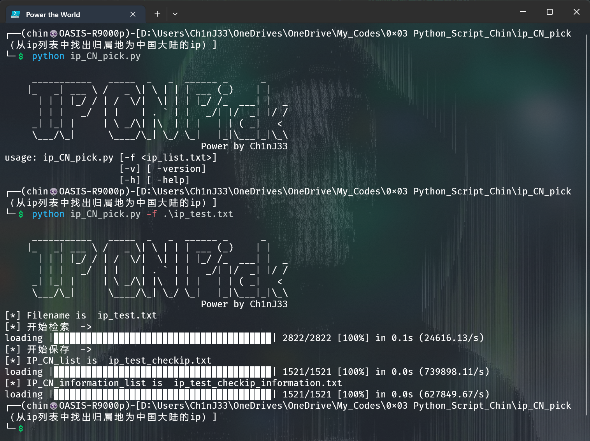

# IP 地址 区域辨别

### Author：Ch1nJ33

https://github.com/ch1nj33

## 环境：[python3]

### 用途：从ip列表中检索出归属地为中国大陆的ip。

### install

```shell
pip install ./install_files/qqwry-py3-1.2.1.tar.gz
pip install ./install_files/about-time-4.2.1.tar.gz
pip install ./install_files/grapheme-0.6.0.tar.gz
pip install ./install_files/alive_progress-3.1.4-py3-none-any.whl
```


### **usage** :

```shell
python ip_CN_pick.py[-f <ip_list.txt>]
```


### 运行截图


